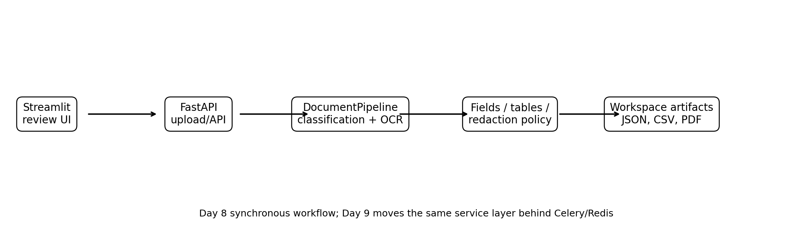
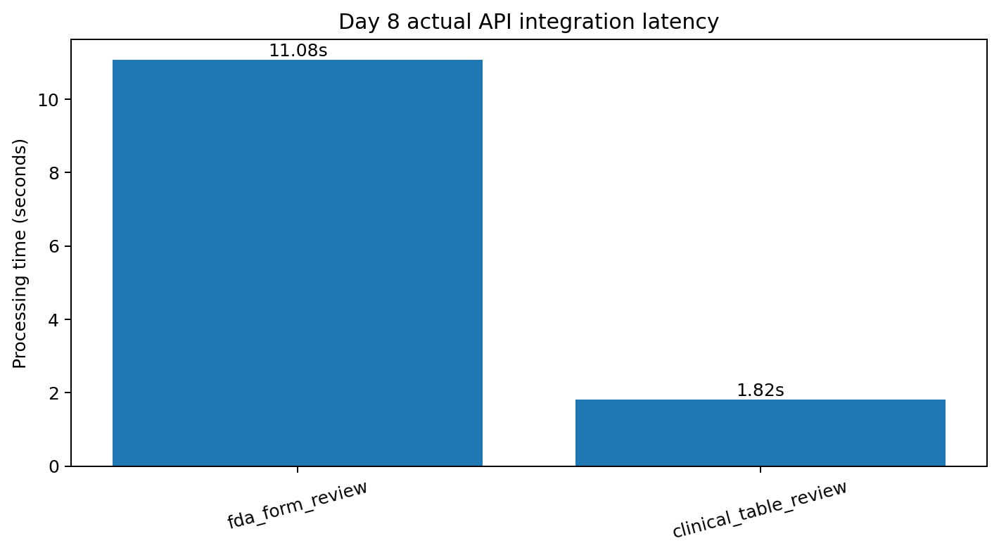

# Day 8 — FastAPI backend and Streamlit review interface

## Objective

Day 8 turns the measured Day 1–7 document pipeline into an interactive application. The
backend accepts regulatory PDFs or document images, classifies each page, routes it to the
appropriate extraction pipeline, applies the configured PII/CCI policy, and exposes
structured and redacted artifacts. The Streamlit frontend provides a human-review surface
for extracted fields, tables, and redaction decisions.

The implementation remains synchronous in Day 8. The service layer is deliberately
separate from the HTTP and UI layers so Day 9 can place the same processing function behind
Celery and Redis without duplicating OCR or extraction code.

## Architecture



### Backend

`api/main.py` exposes:

| Method | Endpoint | Purpose |
|---|---|---|
| GET | `/health` | Liveness and version information |
| GET | `/model-info` | Active OCR, classifier, table, policy, and upload configuration |
| POST | `/v1/documents/process` | Upload and synchronously process a PDF or image |
| GET | `/v1/documents/{document_id}` | Retrieve the stored structured result |
| POST | `/v1/documents/{document_id}/redactions/apply` | Apply reviewer decisions and create a final redacted PDF |
| GET | `/v1/documents/{document_id}/artifacts/{artifact_name}` | Download an approved artifact |

The full generated OpenAPI schema is retained in
`results/day8_app/openapi.json`, and a compact catalog is in
`results/day8_app/endpoint_catalog.csv`.

### Frontend

`app/streamlit_app.py` provides:

- PDF/image upload
- Page-level document classifications
- Annotated page previews
- Extracted field and checkbox tables
- Reconstructed clinical table display
- Editable redaction actions: `redact`, `review`, `retain`, and `ignore`
- Structured JSON, CSV, HTML, audit JSON, and PDF downloads

## Service-layer implementation

The reusable application code is under `src/regdoc_ai/service/`:

- `pipeline.py`: upload validation, rendering, page classification, routed extraction,
  table reconstruction, redaction candidates, previews, and artifacts
- `storage.py`: document workspaces, deterministic IDs, result persistence, artifact lookup,
  and path-traversal protection
- `review.py`: reviewer overrides and final redacted-PDF generation
- `models.py`: Pydantic API contracts

### Supported routing

- FDA 1572, 3454, and 3455 → template coordinates, Tesseract OCR, schema validation,
  checkbox detection, PII/CCI policy
- Clinical protocol cover pages → OCR anchors, regex, and known protocol-metadata validation
- Ruled clinical tables → OpenCV grid extraction, Tesseract cell OCR, CSV/JSON/HTML export
- Uncertain pages → `NEEDS_REVIEW`

## Actual integration tests

The script `scripts/run_day8_integration.py` processed two existing actual-data project
artifacts through the FastAPI endpoint:

1. The populated official FDA 1572 PDF for NCT04796896
2. A real table image cropped from the public NCT04796896 Moderna protocol

It then applied the policy decisions to the FDA document and downloaded every artifact
through the API rather than reading output paths directly.

| Workflow | Pages | Classification | Fields | Checkboxes | Tables | Processing time |
|---|---:|---|---:|---:|---:|---:|
| FDA 1572 review | 2 | FDA_1572 on both pages | 28 | 4 | 0 | 11.08 s |
| Clinical table review | 1 | CLINICAL_TABLE | 0 | 0 | 1 | 1.82 s |

For the FDA 1572 workflow:

- End-to-end field exact match was **100%** across 28 fields
- Checkbox accuracy was **100%** across 4 checkboxes
- 29 policy candidates were returned
- 24 defaulted to permanent redaction
- 5 defaulted to human review
- Reviewer decisions were applied in 0.21 seconds
- Seven downloadable artifacts were verified through HTTP

For the table workflow:

- The page was correctly routed to `CLINICAL_TABLE`
- One 10-row by 6-column table was reconstructed with exact grid shape
- Cell exact match was **56.67%** and mean cell CER was **0.1873**, consistent with the Day 5 local OCR baseline limitation
- CSV, JSON, and HTML table artifacts were generated
- Seven downloadable artifacts were verified through HTTP

These values are recorded in `results/day8_app/integration_summary.csv` and JSON.



## Security and governance controls

- 25 MB upload limit
- Explicit allowlist for PDF and common document-image extensions
- Isolated workspace per deterministic document ID
- Artifact path traversal protection
- Private processing state is not downloadable
- Audit artifacts exclude raw sensitive text
- Reviewer decisions are logged with entity type, action, confidence, page, and coordinates
- CORS defaults to the local Streamlit origin

This is a portfolio implementation, not a production security boundary. Authentication,
malware scanning, rate limiting, encrypted object storage, retention policies, and tenant
isolation are intentionally deferred.

## Installation and launch

Install the core project and the application dependencies:

```bash
conda env create -f environment.yml
conda activate regdoc-ai
pip install -e .
pip install -r requirements-app.txt
```

Run the API:

```bash
uvicorn api.main:app --host 0.0.0.0 --port 8000
```

Run the UI in a second terminal:

```bash
streamlit run app/streamlit_app.py --server.port 8501
```

The current restricted runtime already contains FastAPI, Uvicorn, HTTPX, and multipart
support, so the API and integration workflows were executed locally. Streamlit could not
be downloaded in this runtime; its application code was compiled and its API contract was
validated, but no local browser session is claimed. The complete launch path is retained
for Colab/local Anaconda use.

## Tests

Day 8 adds tests for:

- Health and model-information endpoints
- Unsupported upload rejection
- Artifact traversal protection
- Private-state download blocking
- Deterministic document IDs
- Redaction-review model validation

All **42 tests pass**.

## Limitations and next step

- Processing is synchronous and designed for single documents or short PDFs.
- Fixed FDA-form extraction currently supports 1572, 3454, and 3455.
- Local filesystem storage is used instead of PostgreSQL/object storage.
- There is no authentication or multi-user isolation.
- Deep PaddleOCR, PP-StructureV3, Table Transformer, and MobileNet metrics remain separate
  model-enabled-environment tasks and are not fabricated here.

Day 9 will add PostgreSQL metadata, object-style storage, Redis, Celery workers, job status,
page-level retries, and asynchronous batch processing while preserving the Day 8 API and
service layer.
